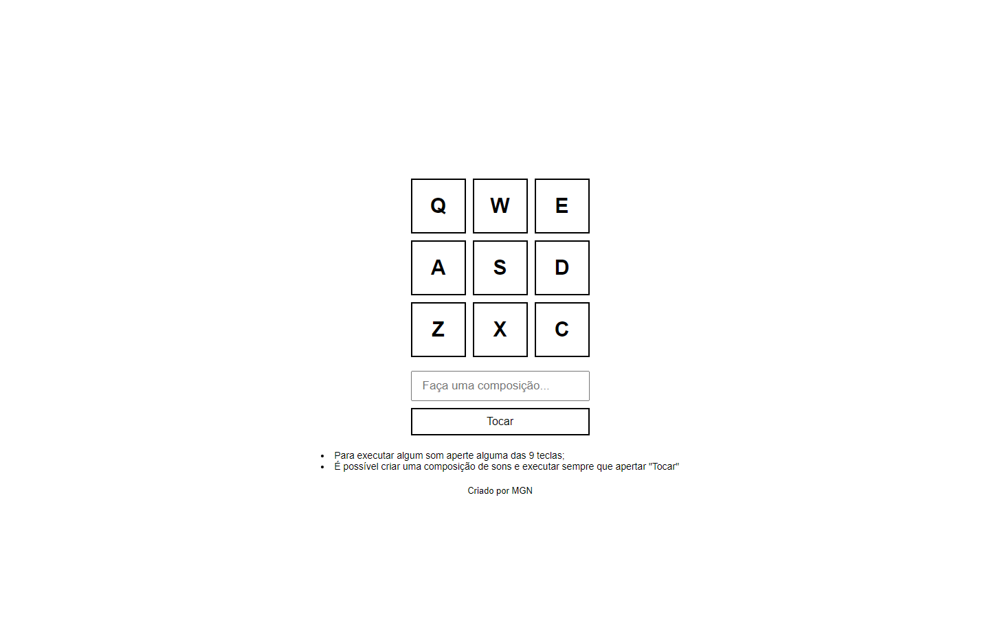

<h1 align="center">Bateria | MGN </h1>

  <a href="#-tecnologias">Tecnologias</a>&nbsp;&nbsp;&nbsp;|&nbsp;&nbsp;&nbsp;
  <a href="#-projeto">Projeto</a>&nbsp;&nbsp;&nbsp;|&nbsp;&nbsp;&nbsp;
  <a href="#-redes">Redes</a>

---

  

---

## 🚀 Tecnologias

Esse projeto foi desenvolvido com as seguintes tecnologias:

-   HTML
-   CSS
-   JavaScript

## 💻 Projeto

Este projeto envolve o desenvolvimento de uma bateria na qual é possível reproduzir os sons de uma bateria ao clicar em uma das nove teclas dispostas no layout do projeto. Este trabalho reforça os conceitos de utilização de eventos e execução de arquivos de áudio. É uma forma prática de aprender sobre esses conceitos e proporcionar uma experiência musical envolvente.

---

## 🔗 Redes

Estas são minhas redes sociais. Sinta-se a vontade para mandar uma mensagem.

-   [Linkedin](https://www.linkedin.com/in/eomgn/)
-   [Instagram](https://www.instagram.com/matheuzngr/)
-   [Twitter](https://twitter.com/eomgn)
